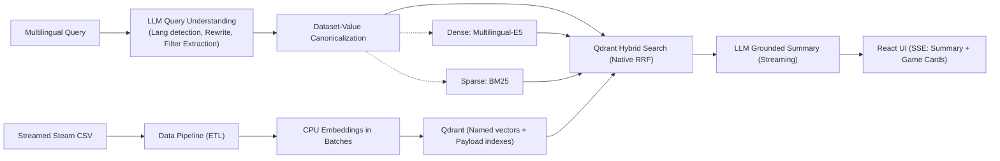

<div align="center">
  <h1>🎮 Steam Games RAG</h1>
  <p><strong>A Production-Ready, Multilingual Hybrid Search & RAG System for Game Discovery</strong></p>
  
  <p>
    
    
    
    
    
    
  </p>

  <h2>
    <a href="https://steam.constantine.software/">
      <kbd> <br> 🔴 TRY THE LIVE DEMO 🔴 <br> </kbd>
    </a>
  </h2>
</div>

---

> **Overview**: This project is a flagship demonstration of advanced **AI Engineering** principles. It goes beyond basic Retrieval-Augmented Generation (RAG) by implementing **Agentic Query Understanding**, **Native Hybrid Search (Dense + Sparse with RRF)**, and **Streaming Generative Summaries**. Built for scale, it is rigorously evaluated against Information Retrieval (IR) metrics and fully containerized for deployment.

## 🚀 Key AI Engineering Capabilities

* **Agentic Query Routing & Understanding:** Uses an LLM to dynamically parse natural language into canonicalized structural filters (e.g., `"co-op space games for mac"` $\rightarrow$ `genres: [Co-op], os: [mac], query: space games`). Features automatic language detection and query rewriting.
* **Native Qdrant Hybrid Search:** Utilizes Qdrant's highly optimized Reciprocal Rank Fusion (RRF) at the database layer. This fuses Dense embeddings (`intfloat/multilingual-e5-large`) and Sparse embeddings (`Qdrant/bm25`) without heavy Python-side memory overhead or data transfer bottlenecks.
* **Low-Latency Streaming:** Implements Server-Sent Events (SSE) to stream LLM-grounded answers directly to the React UI, masking generation time and providing a snappy "ChatGPT-like" typing experience.
* **Rigorous IR Evaluation:** The system isn't just built; it's *measured*. Features a custom evaluation suite computing Recall, MRR, nDCG, and Filter Extraction F1 across a multilingual ground-truth dataset.

## 🧠 System Architecture

The architecture intentionally separates heavy data engineering (ETL/embedding) from the lightweight, highly concurrent FastAPI serving layer.



## 🛠️ Tech Stack

- **Backend:** Python, FastAPI, AsyncIO, Uvicorn
- **AI / ML Models:** Gemini 3.6 Flash (`gemini-3.6-flash`), `intfloat/multilingual-e5-large` (Multilingual Dense Embeddings), `Qdrant/bm25` (Sparse)
- **Vector Database:** Qdrant
- **Frontend:** React, TypeScript, Vite
- **Infrastructure:** Docker, Docker Compose
- **Quality Assurance:** Ruff, ESLint, Vitest, Pytest

## 💻 Quick Start (Local Development)

**Prerequisites:** 
- Docker Desktop/Engine with Docker Compose
- At least 8 GB of free memory (for comfortable CPU embedding during ingestion)
- Gemini API Key

### 1. Configuration
Clone the repository and set up your environment variables:
```bash
cp .env.example .env
```
Open `.env` and add your `GEMINI_API_KEY`.

### 2. Data Preparation
Ensure the raw Steam dataset is placed at `data/steam_games.csv` in the root of the project.

### 3. Start Infrastructure
Start the FastAPI backend, Qdrant vector database, and React frontend:
```bash
docker compose up -d --build
```

### 4. Run the ETL / Ingestion Pipeline (One-Time)
The API is stateless and expects data to be present in Qdrant. You must run the ingestion script once to embed the games:
```bash
# Run the ETL pipeline inside the backend container
docker compose exec backend python -m data_pipeline.ingest
```

### 5. Access the App
Open [http://localhost:5173](http://localhost:5173) in your browser.

## 🧪 Development & Testing

```bash
make lint                 # Ruff plus ESLint, TypeScript, and production build
make test                 # backend unit and frontend component tests (vitest/pytest)
make eval                 # Multilingual Recall/MRR/nDCG/filter-F1/latency report
```

## 🐛 Troubleshooting

- `API Error 503`: The API is running but the Qdrant index is empty. Did you run the ingestion script?
- `OOM (Out of Memory)` during ingestion: Reduce `EMBEDDING_BATCH_SIZE` and `INGESTION_BATCH_SIZE` in your `.env` file.

---
<p align="center">
  <i>Built with ❤️ for AI Engineering excellence.</i>
</p>
