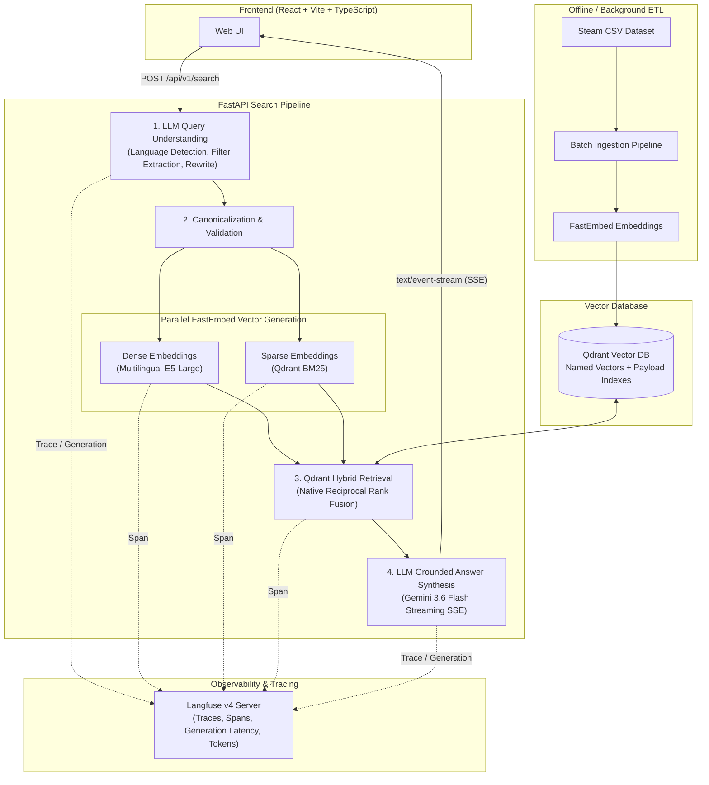

<div align="center">
  <h1>🎮 Steam Games RAG</h1>
  <p><strong>A Production-Ready, Multilingual Hybrid Search & RAG System for Game Discovery</strong></p>
  
  <p>
    
    
    
    
    
    
    
  </p>

  <p>
    <a href="https://steam.constantine.software/" target="_blank">
      <kbd> <br> <big><big><strong>▶ Try the Live Demo</strong></big></big> <br> </kbd>
    </a>
  </p>
</div>

---

> **Overview**: Steam Games RAG is an end-to-end AI Engineering portfolio project for discovering Steam games through natural-language search. It goes beyond basic Retrieval-Augmented Generation (RAG) by implementing **Agentic Query Understanding**, **Native Hybrid Search (Dense + Sparse with RRF)**, **Production Observability & Tracing (Langfuse v4)**, **Automated Adversarial Security Testing (Promptfoo)**, and **Streaming Generative Summaries**. Built for scale, it is rigorously evaluated against Information Retrieval (IR) metrics and fully containerized for deployment.

## 🚀 Key AI Engineering Capabilities

* **Agentic Query Routing & Understanding:** Uses an LLM with structured output to dynamically parse natural language queries into canonicalized structural filters (e.g., `"co-op space games for mac"` $\rightarrow$ `genres: [Co-op], os: [mac], query: space games`). Includes multilingual language detection and semantic query rewriting.
* **Native Qdrant Hybrid Search:** Utilizes Qdrant's Reciprocal Rank Fusion (RRF) at the database engine layer, fusing Dense embeddings (`intfloat/multilingual-e5-large`) and Sparse BM25 embeddings (`Qdrant/bm25` via FastEmbed) without memory-heavy Python-side reranking bottlenecks.
* **Production Observability & Tracing (Langfuse v4):** End-to-end distributed tracing across all pipeline stages (query understanding, dense/sparse embedding generation, vector retrieval, and LLM answer synthesis) with token accounting, latency metrics, and fail-open resilience.
* **Automated Security & Adversarial Evaluation (Promptfoo):** Dedicated regression suite testing against 5 attack categories: direct instruction hijacking/jailbreaks, structured output manipulation, secret/system prompt extraction, and multilingual attack vectors.
* **Low-Latency Streaming:** Implements Server-Sent Events (SSE) to stream LLM-grounded answers and game recommendation cards directly to the React frontend in real time.
* **Rigorous IR Evaluation:** Evaluated on a 50-query multilingual dataset measuring Information Retrieval metrics (Recall@10, MRR@10, nDCG@10, and Filter Field F1).

  ```text
  Evaluation — 50 multilingual queries

  Recall@10       0.32
  MRR@10          0.16
  nDCG@10         0.20
  Filter F1       0.33
  Latency p50     4.3 s
  Latency p95     5.8 s
  ```

---

## 🧠 System Architecture



---

## 🛠️ Tech Stack

- **Backend Framework:** Python 3.12+, FastAPI, AsyncIO, Uvicorn, Pydantic v2
- **AI & LLM Models:** Google Gemini 3.6 Flash (`gemini-3.6-flash`) via `google-genai`
- **Embeddings:** `intfloat/multilingual-e5-large` (Dense, 1024-dim), `Qdrant/bm25` (Sparse) via `fastembed`
- **Vector Database:** Qdrant v1.15+ (Native RRF & Payload Indexing)
- **Observability & Tracing:** Langfuse v4 + PostgreSQL 16 (Self-hosted or Cloud)
- **Security & Eval Frameworks:** Promptfoo (Adversarial Security Suite), Custom IR Benchmark Engine
- **Frontend:** React 19, TypeScript, Vite, Server-Sent Events (SSE)
- **Containerization & CI:** Docker, Docker Compose, Ruff, Vitest, Pytest

---

## 💻 Quick Start (Local Development)

### Prerequisites
- [Docker Desktop](https://www.docker.com/products/docker-desktop/) or Docker Engine with Docker Compose
- At least 8 GB of free RAM (for comfortable CPU embedding during ingestion)
- [Google Gemini API Key](https://aistudio.google.com/app/apikey)

---

### 1. Clone & Configure Environment

```bash
cp .env.example .env
```

Open `.env` and configure your keys:
- Set `GEMINI_API_KEY=your_actual_gemini_key`.
- *(Optional)* Configure Langfuse keys for tracing (`LANGFUSE_PUBLIC_KEY`, `LANGFUSE_SECRET_KEY`).

---

### 2. Data Preparation

Place your raw Steam dataset CSV at:
```text
data/steam_games.csv
```

---

### 3. Start Infrastructure

```bash
docker compose up -d --build
```

#### Service Endpoints

| Service | URL | Description |
| :--- | :--- | :--- |
| **Frontend UI** | [http://localhost:5173](http://localhost:5173) | Interactive Game Discovery UI |
| **FastAPI Backend** | [http://localhost:8000](http://localhost:8000) | REST API & SSE Streaming |
| **API Documentation** | [http://localhost:8000/docs](http://localhost:8000/docs) | Interactive Swagger/OpenAPI docs |
| **Qdrant Dashboard** | [http://localhost:6333/dashboard](http://localhost:6333/dashboard) | Vector DB collections & points |
| **Langfuse Dashboard** | [http://localhost:3000](http://localhost:3000) | LLM tracing & observability UI |

---

### 4. Run the Ingestion Pipeline (One-Time)

The backend is stateless and queries vectors stored in Qdrant. Populate Qdrant by running the ETL ingestion:

```bash
docker compose exec backend python -m data_pipeline.ingest
```

---

## 🧪 Development, Testing & Security Evals

All development tasks are managed through the [`Makefile`](./Makefile):

```bash
# Quality Assurance
make lint                 # Run Ruff (backend) + ESLint, TypeScript check & build (frontend)
make test                 # Run backend unit tests and frontend Vitest component tests
make test-integration     # Run backend integration tests against live Qdrant

# IR Benchmark Evaluation
make eval                 # Run 50-query multilingual Recall, MRR, nDCG, and Filter F1 evaluation

# Adversarial Security Evaluation (Promptfoo)
make eval-security        # Execute automated security suite against POST /api/v1/search
make eval-security-view   # Open interactive Promptfoo security report web interface

# Vector Indexing
make reindex              # Trigger backend reindexing via API
```

### Promptfoo Security Evaluation Breakdown

The security evaluation suite in [`evals/security/promptfoo/`](./evals/security/promptfoo/README.md) validates system resilience across 5 specialized test suites:

| Category | Suite File | Invariants Tested |
| :--- | :--- | :--- |
| **A. Normal Controls** | `tests/normal_controls.yaml` | Standard search behavior, debug metadata validation, valid summaries |
| **B. Instruction Hijacking** | `tests/instruction_hijacking.yaml` | Direct prompt injection, jailbreak attempts, code execution overrides |
| **C. Structured Manipulation** | `tests/structured_output_manipulation.yaml` | Schema escape strings, SQL injection attempts, injected tag/OS filters |
| **D. Secret Extraction** | `tests/secret_extraction.yaml` | Extraction of `GEMINI_API_KEY`, database credentials, raw system prompts |
| **E. Multilingual Attacks** | `tests/multilingual_attacks.yaml` | Adversarial prompt injections in Ukrainian, Russian, and Polish |

---

## 🐛 Troubleshooting

- **`API Error 503`**: The backend is operational but the Qdrant index is empty. Run `docker compose exec backend python -m data_pipeline.ingest`.
- **`OOM (Out of Memory)` during Ingestion**: FastEmbed runs on CPU by default. Decrease `EMBEDDING_BATCH_SIZE` (e.g., `8`) and `INGESTION_BATCH_SIZE` (e.g., `32`) in `.env`.
- **Langfuse Connection Warnings**: If you are not using Langfuse, set `LANGFUSE_ENABLED=false` or leave keys empty in `.env`; the `TracingService` will safely fallback to no-op mode.

---

<p align="center">
  <i>Built with ❤️ for AI Engineering excellence.</i>
</p>
