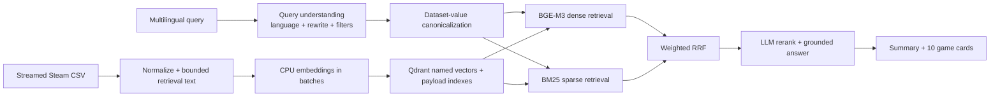

# Steam Games RAG

A local, multilingual hybrid-search MVP for roughly 113,000 Steam games. It streams a local CSV into Qdrant, stores local BGE-M3 dense and BM25 sparse vectors on each game point, applies explicit filters to both retrieval branches, fuses them with weighted reciprocal-rank fusion, and uses Gemini with an OpenAI fallback for query interpretation and grounded reranking.

## Architecture



The backend follows dependency inversion: application services depend on small embedding, vector-store, and structured-LLM protocols; Qdrant, Gemini, OpenAI, FastAPI, and local embedding libraries live at the edges. Prompts are Git-versioned Jinja templates selected by `prompts/registry.yaml`; invalid prompt metadata fails startup.

## Start locally

Requirements: Docker Desktop/Engine with Compose, at least 8 GB free memory for comfortable CPU embedding, and Gemini and/or OpenAI credentials.

1. Copy `.env.example` to `.env` and add provider keys. The configured defaults are `gemini-3.6-flash`, `gpt-5.6-luna`, and `BAAI/bge-m3`; model IDs remain environment-controlled.
2. Put the production CSV at `data/steam_games.csv`. All `data/` contents except `.gitkeep` are ignored. The legacy root `games.csv`, if present, is also ignored and is never copied into an image.
3. Run `docker compose up --build` (or `make up`).
4. Open <http://localhost:5173>. The API is at <http://localhost:8000>.

The first backend start waits for Qdrant, creates the named `dense`/`bm25` collection and filter indexes, then starts indexing only if point count is zero. Qdrant data and model downloads persist in named volumes. A subsequent start skips indexing. Search returns typed `INDEX_NOT_READY` until ingestion finishes.

Ingestion progress is also persisted in `data/indexing_state.json`. If a process stops after writing only part of the collection, the next start marks that non-empty collection as failed instead of silently treating it as complete; recovery stays manual so startup never destroys existing points unexpectedly.

Progress and health:

```bash
curl http://localhost:8000/health/live
curl http://localhost:8000/health/ready
curl http://localhost:8000/api/v1/index/status
```

The first run downloads embedding models and indexes all rows, so it is intentionally much slower than later starts. CSV rows and vectors are processed in bounded batches; descriptions are HTML-cleaned and retrieval text is hard-truncated at `RETRIEVAL_TEXT_MAX_CHARS` (default 3,000 characters). Display descriptions remain in payload and are never sent unbounded to an LLM.

## Search API

```bash
curl -X POST http://localhost:8000/api/v1/search \
  -H 'Content-Type: application/json' \
  -d '{"query":"Покажи кооперативні космічні ігри для Linux з рейтингом від 80%","debug":true}'
```

`debug=false` omits diagnostics. Debug mode exposes normalized filters, prompt versions, safe provider/model names, timings, fallback state, and dense/BM25/fusion/rerank ranks and scores. It never returns prompts or credentials.

The entire search has a 15-second hard deadline. All rate-limit waits, retries, both LLM stages, embeddings, and retrieval share it. Gemini gets at most three calls total across both stages. Only 429, 5xx, network, and provider timeouts retry with bounded jitter; non-retryable output failures switch immediately to OpenAI, which remains active for the rest of that search. If neither provider completes required stages, the API returns `503 LLM_UNAVAILABLE` with no results.

## Prompts, recovery, and configuration

Change active prompt versions only in `prompts/registry.yaml`; each version has metadata plus strict Jinja system/user templates. Do not place prompt fallbacks in Python.

If indexing is interrupted, inspect status/logs and run `make reindex` (or `curl -X POST http://localhost:8000/api/v1/index/reindex`). This deletes only the configured Qdrant collection and rebuilds it from the configured CSV. There is deliberately no incremental or periodic update in this MVP.

All retrieval sizes, RRF weights, batch sizes, rate limits, deadlines, model IDs, paths, collection names, CORS origins, and log level are documented in `.env.example`. `DENSE_VECTOR_SIZE` must match the chosen dense model.

## Tests and evaluation

```bash
make lint                 # Ruff plus ESLint, TypeScript, and production build
make test                 # backend unit and frontend component tests
make test-integration     # real Qdrant collection/index/upsert/hybrid/filter tests
make eval                 # multilingual Recall/MRR/nDCG/filter-F1/latency report
```

Integration tests create a uniquely named temporary Qdrant collection and remove it afterward. The committed three-game fixture is synthetic. The evaluation dataset covers English, Ukrainian, German, Spanish, and Polish; evaluation calls the running application but needs no separate evaluator model. It writes `backend/eval-report.json`.

CI never performs live Gemini/OpenAI requests. Unit providers are fakes, while the integration job uses a real Qdrant service.

## Troubleshooting

- `CSV not found`: place it exactly at `data/steam_games.csv`, or override `STEAM_CSV_PATH` when running outside Compose.
- `INDEX_NOT_READY`: watch `/api/v1/index/status`; a first model download and full 113k-row CPU import takes time.
- `LLM_UNAVAILABLE`: configure at least one valid key/model and check RPM settings/account limits.
- Dense-size errors: restore BGE-M3 with size 1024 or set `DENSE_VECTOR_SIZE` to the output size of the replacement model, then reindex.
- Out of memory: reduce `EMBEDDING_BATCH_SIZE` and `INGESTION_BATCH_SIZE`.

## MVP limitations

There is no authentication, pagination, price data, incremental ingestion, cloud deployment, or periodic refresh. Canonical filter values are generated from indexed payloads. The 10-second value is an unproven normal-latency target—not a guarantee—while 15 seconds is enforced. Production latency and the full 113,000-row import must be measured on the target CPU and provider accounts.
